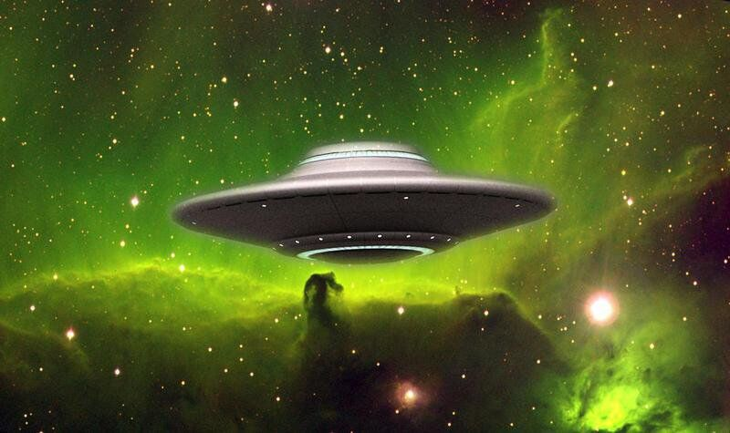
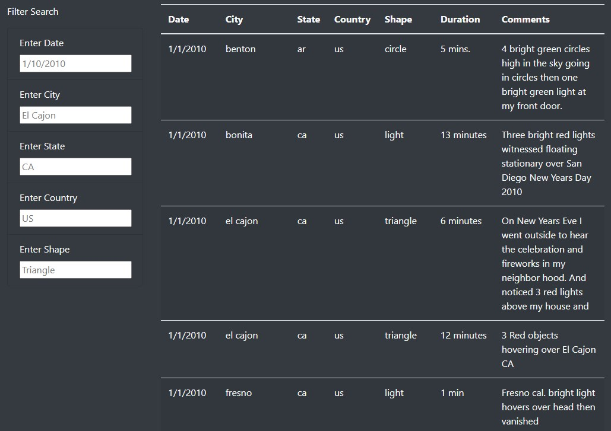
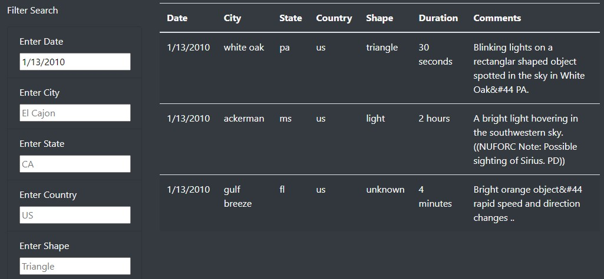
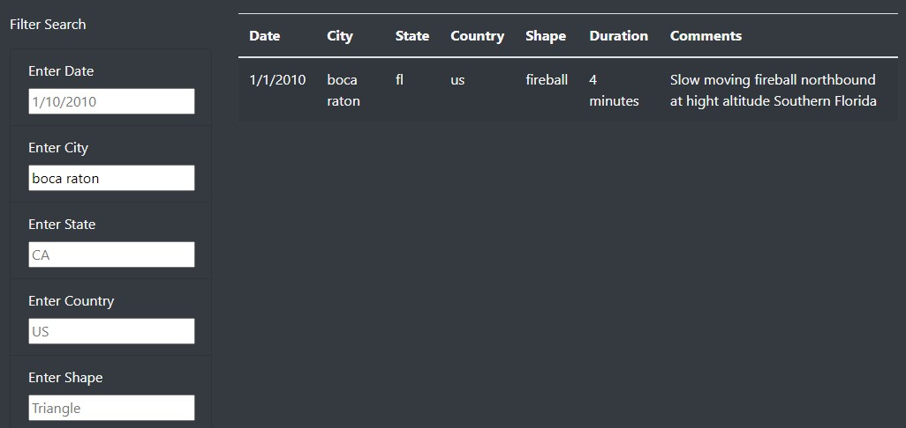
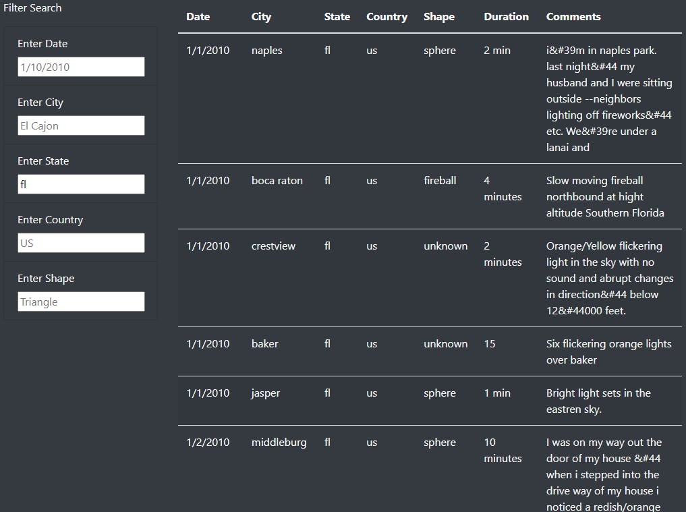
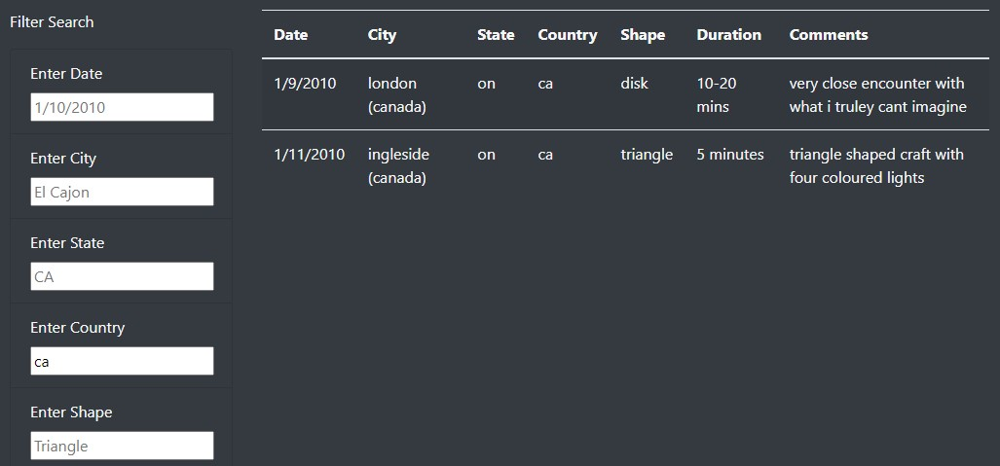
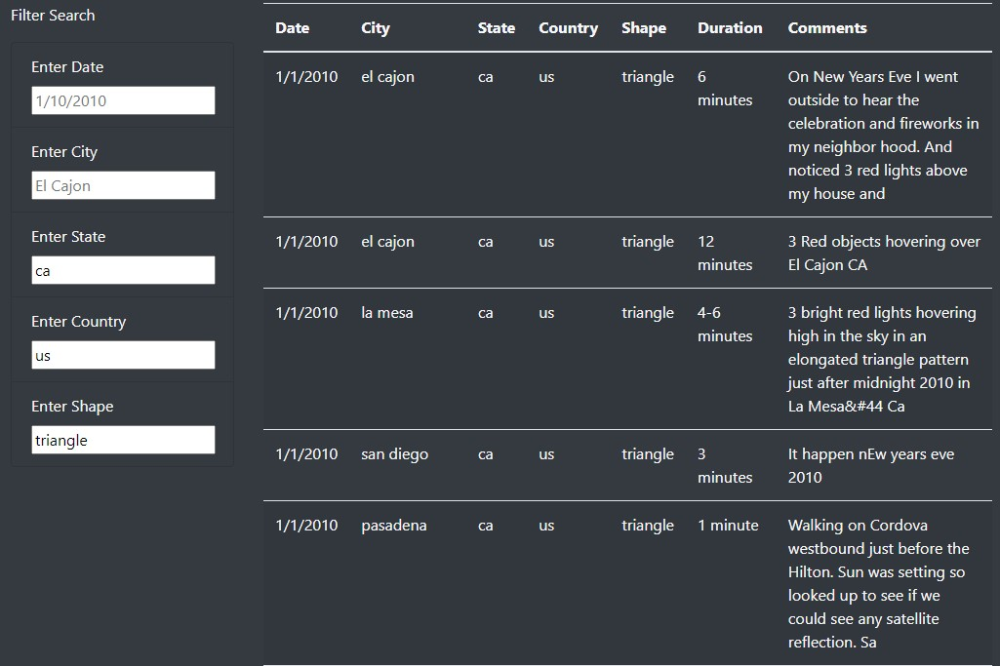

# UFOs
 
 ## An Interactive analysis within a searchable database of UFO sightings using Javascript in an HTML environment. 
 

 
 ### Project Overview
 
The purpose of this project was intended to create a searchable database containing a dataset of UFO sightings using Javascript. The user is able to search the database using the following parameters: date, city, state, country, and shape. Using the provided search functions, the user is able to explore the dataset and analyze reported UFO sightings that occured in the US in January of 2010.   

### Resources

#### Datasets
* data.js

#### Software

* Javascript
* D3 library
* HTML
* CSS
* Bootstrap

### Results

An interactive, searchable database was built that returned results to the user based on the parameters chosen. The webpage was designed using Javascript and HTML and styled with CSS and Bootstrap. Below are screenshots that display examples of the search functions operating as intended. 

In the upper left corner of the webpage, a button was created called "UFO Sightings" that allows the user to clear the data and refresh the page to conduct a new search. 

Search bars are provided, filled with sample data, that display the parameter options the user can choose from while conducting a search. 

Below, the screenshot shows an example of the user's return when searching by date only. 

Below, the screenshot shows an example of the user's return when searching by city only. 

Below, the screenshot shows an example of the user's return when searching by state only.

Below, the screenshot shows an example of the user's return when searching by country only.

Below, the screenshot shows an example of the user's return when searching with multiple parameters selected. 

### Analysis of Data

The dataset utilized for this project only includes reported UFO sightings from January of 2010. After an analysis of this data, the user can conclude the following observations:

#### Fireworks, or something more? 

The highest number of sightings (34 out of 111 entries, ) occurred on January 1, 2010, representing 31% of the dataset. With a more comprehensive dataset containing data spanning over the course of multiple years, further analysis could be conducted to determine if this is a reoccuring phenomenon, or if it is exclusive to New Years of 2010. 

#### Good times, tan lines and unidenfied objects.

The highest numbers of sightings occurred in coastal regions of the United States. The following states weighed in with the following metrics:
* California: 30 sightings, 27% of the dataset.
* Florida: 10 sightings, 9% of the dataset
* Massachussetts: 7 sightings, 6.3% of the dataset. 

To narrow this analaysis even further, El Cajon, CA reported the highest numbet of sightings (5), while the remaining cities in the dataset each reported three or less. The remaining states in the dataset reported four or less UFO sightings. Further analysis with a larger dataset should be conducted on coastal territories and UFO sighting frequency to determine the geographical significance. 

#### "Time flies over us, but leaves its shadow behind.” - Nathaniel Hawthorne

With reportings ranging from one second to several hours (and one outlier report of three weeks) long, the highest number of reported UFO sightings were between 1 and 5 minutes in length (Note that 7.2% of the dataset did not include the durations of the sightings), weighing in at 30% of the dataset (33 reportings). 

#### “Mankind was not absolutely alone among the conscious things of earth, for shapes came out of the dark to visit the faithful few.” - H.P. Lovecraft

In the analysis of the UFO shapes reported in this dataset, 23.4% (26 reports) reported miscellaneous variations of light(s). Below is a breakdown of the reported UFO shapes organized by the number of reported sightings. 

* Light:	26, 23.4% 
* Triangle:	18, 16.2%
* Unknown/Other: 18, 16.2%
* Sphere:	11, 9.9%
* Fireball:	7, 6.3%
* Disk:	5, 4.5%
* Formation:	5, 4.5%
* Circle:	4, 3.6%
* Chevron:	3, 2.7%
* Changing:	3, 2.7%
* Oval:	3, 2.7%
* Teardrop:	2, 1.8%
* Cigar:	2, 1.8%
* Cross:	1, .9.0%
* Flash:	1, .9.0%
* Cylinder:	1, .9.0%
* Rectangle:	1, .9.0%

### Summary

Overall, this analysis and webpage could be improved with a multitude of changes. To start, the provided dataset does not allow the user to conduct a comprehensive analysis outside of January, 2010 in the United States. If this dataset were to include live data listing both historical and current as well as global criteria, a much more thorough analysis could be conducted. Interactive heatmaps also searchable by time specifications would be a great addition to this concept, allowing the user to visaulaize UFO phenomena by region. To expand on these suggestions, a latest news section that populates the most current UFO news articles would also be a relevent and insightful addition to this webpage. An archive tab listing historical UFO reports would add to the researchable depth of this page as well. A search function allowing the user to choose date ranges instead of specific dates would also be beneficial to the webpage's functionality, as well as allowing the user to search using non-case sensitive perameters (currently, the user must use case sensistive entries). 

### "We must ask ourselves...are they really a hoax? Are we truly alone? Or are we being lied to?" - Fox Mulder, the X-Files, Season 10: My Struggle
